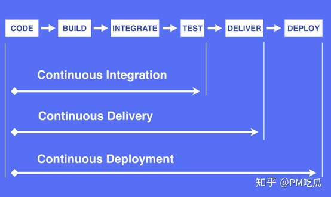
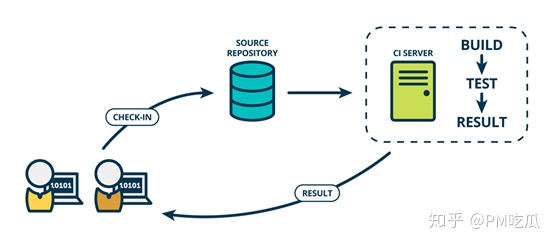
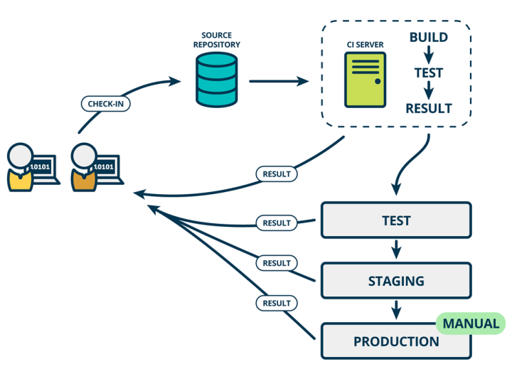
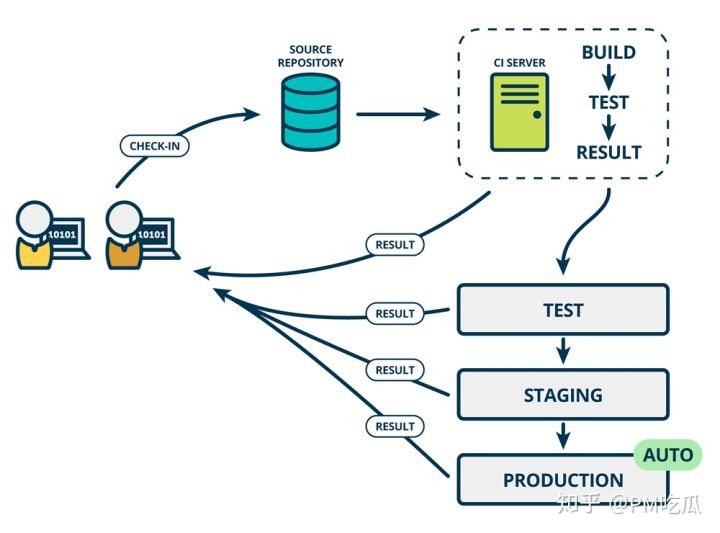
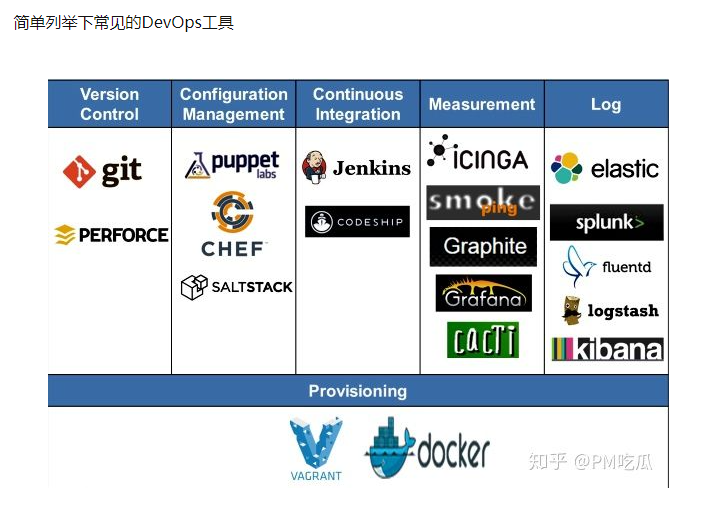
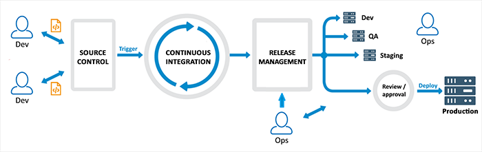
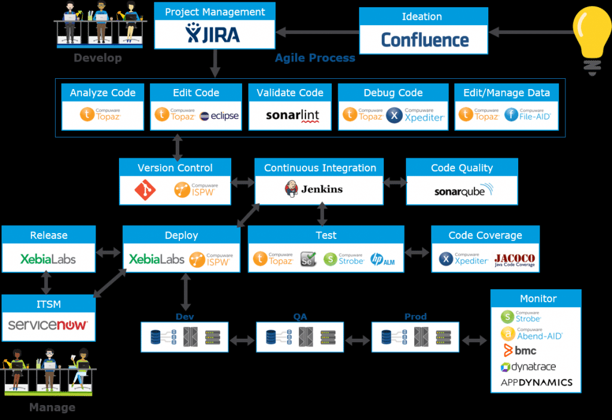
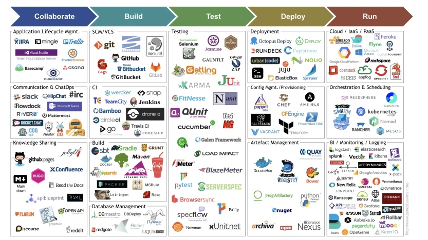

敏捷开发核心
拥抱变化
快速迭代

# CI/CD

CI 强调了驱动构建和测试的自动化工具。 
开发人员提交了新代码之后，立刻自动的进行构建、（单元）测试。根据测试结果，我们可以确定新代码和原有代码能否正确地集成在一起。
持续集成过程中很重视自动化测试验证结果，对可能出现的一些问题进行预警，以保障最终合并的代码没有问题。

持续交付在持续集成的基础上，将集成后的代码部署到更贴近真实运行环境的「类生产环境」（production-like environments）中。交付给质量团队或者用户，以供评审。如果评审通过，代码就进入生产阶段。
持续交付中，部署到生产环境是手动的

持续部署是指当交付的代码通过评审之后，自动部署到生产环境中。持续部署是持续交付的最高阶段。

DevOps 专注于敏捷开发过程中文化和角色的局限性。 DevOps 的目的是解决组织中过度专业化和不同部门人员沟通不畅导致的一些痛点，例如对生产问题无法快速甚至有效响应。DevOps 组织通过对每个团队进行彼此技能的交叉培训来打破运维和开发之间的障碍。

Jenkins 过去一直是大部分公司的选择，但这个现象正在发生改变，随着公有云服务、Docker，SaaS 的普及，越来越多的企业开始选择在线托管型持续集成系统。

# 2. devops
DevOps是Development和Operations缩写，现在市场需求和技术变化都非常快，为了配合市场的需求，开发周期就要变短（但是软件质量不能因为这个原因降低）

传统的开发过程中与运维相关的部分比如测试，发布，部署都很花时间，所以往往开发人员和运维人员之间有着很深的隔阂，并且两者沟通效率低，为了解决这个问题，使之能够更专注于开发。就有人提出了DevOps这理念。

传统的开发方式是线性的，开发与运维之间存在隔阂而且沟通效率低下。而DevOps使开发与运维的流程形成了一个闭环，打破了隔阂，各部门协作更紧密，提高了协作效率

devops是随着容器技术和微服务才流行起来，微服务是由一个个团队组成，每团队有自己的服务，做好后，可以独立的进行测试、开发、部署，然后整个应用组合到一起。

简单的说，DevOps=团队文化+流程+工具

团队文化的意思很简单就是你的团队要知道并认可DevOps理念
然后就要通过具体的流程和工具来实现这个理念。

devops关键组件
Planning : Jira or Azure DevOps Board(agile)
build automation
Continuous Integration tools
Testing tools
Version control system
Code review tools
Continuous Delivery/release management tools
monitoring
orchestration
artefact management
Provisioning
release management

## 2.1 release management
在部署到不同环境下，需要不同的配置，能自动化就很好
Release Management removes this pain and can handle this for you by parameterizing configuration values at runtime when the release is published.

Deployment architectures can vary somewhat, a common 4 tier architecture is DEV, TEST, STAGING, and PROD. （development, system testing, staging, and production）。

You may wish to add a User Acceptance Testing environment that sits between STAGE and PROD.  Doing so lets the client validate the release post system test by your team and allows you to release software only after the client has deeded it “production ready”.

Staging is an environment for final testing immediately prior to deploying to production. It seeks to mirror the actual production environment as closely as possible and may connect to other production services and data, such as databases.

Use your source control provider to generate release notes that contain all new features and share with the team and user community
Circulate documentation or implementation guides across each function (test/dev ops etc.) that lets them know exactly what needs to be deployed and how.

Delete any additional branches after you have completed your merge to keep the source control repository clean.

After the deployment is complete, perform key smoke tests to check everything is working as expected in the production environment.

As a rule of thumb, don‘t perform upgrades on a Monday or Friday!
## branch管理
Only merge the code from the development branch to the master branch when you want to deploy, don‘t try to merge anything in advance otherwise, you‘ll give yourself unnecessary work.

