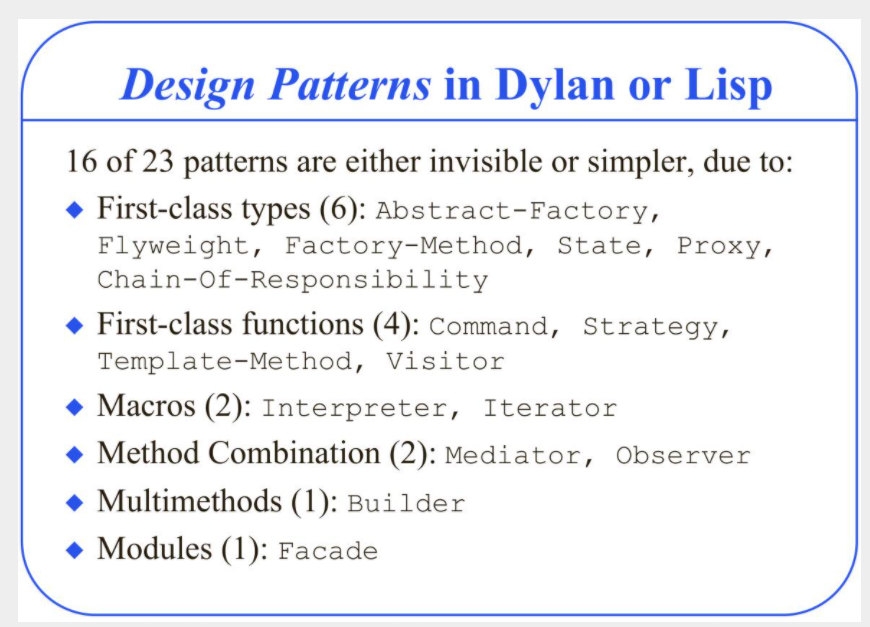
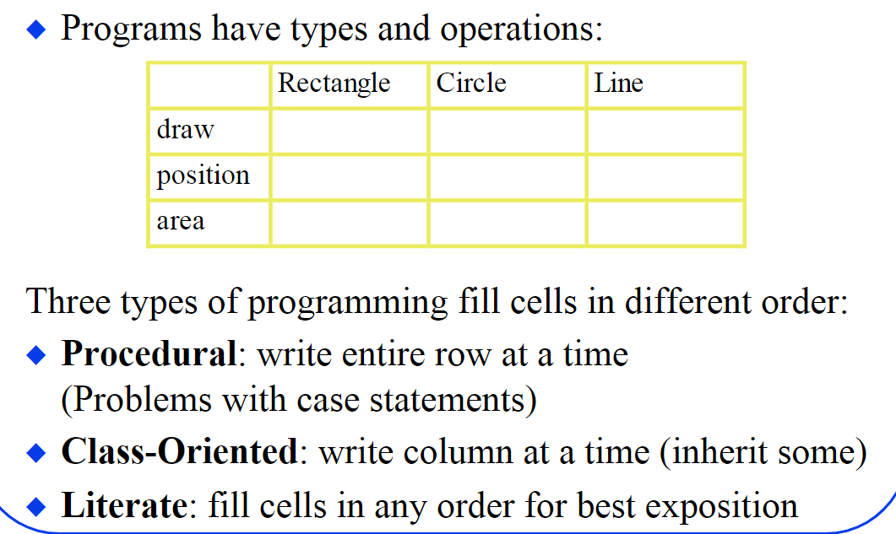
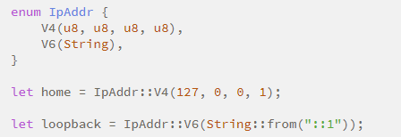

# 不要使用继承
inheritance mixes orthogonal concepts (code reuse and subtyping).

not allow fine grain control over which part of the superclass interface is inherited.

所以其实可以把这两个部分拆分出来

# 设计模式

其中极少数值得一提的“模式”，也许是 visitor 和 interpreter。
很可惜的是，只有很少的人明白如何使用它们。所谓的 visitor，本质上就是函数式语言里的含有“模式匹配”（pattern matching）的递归函数。

在函数式语言里，这是多么轻松的事情。可是因为 Java 没有模式匹配，所以很多需要类似功能的人就得使用 visitor pattern。

为了所谓的“通用性”，他们往往把 visitor pattern 搞出多层继承关系，让你转几道弯也搞不清楚到底哪个 visitor 才是干实事的。

## Design Patterns in Dynamic Programming 

大部分自带了pattern,一般是通过macro的形式提供

16 of 23 patterns have qualitatively simpler implementation in Lisp or Dylan than in C++ for at least some uses of each pattern 

大部分模式可以使用更好的方法解决，如下图

## 创建型模式

创建型模式，简单点解释，就是根据输入创建不同的子类。唯一值得一提的是单例模式（Singleton pattern）。
其他就是可以通过高阶函数实现(first class).

Can use memoization to implement Singleton pattern。Don’t need singletons if you can dispatch on constants。

对于简单工厂，定义一个函数即可

对于抽象工厂模式我们可以通过factory function来替代fuctory class, factory function返回用于构造实例的函数

例如下面例子。
建立一个 Pizza 店类，然后派生出纽约风味 Pizza 店和芝加哥风味 Pizza 店。
，使用的都是一个抽象的原料供应商，并没有指明地域。

只有在 Pizza 店类的派生类中才指明原料供应商的地域（用户不需要关心）。例如，在纽约风味 Pizza 店类中，createPizza 成员函数设定原料由纽约原料供应商提供，具体化原来的抽象原料供应商，

把一个闭包当成 Pizza 店，外面再包一层函数（可以想象成「制造工厂的工厂」）。Pizza 店（闭包）接收 item 参数以供顾客指定芝士 Pizza 还是蔬菜 Pizza，而制作 Pizza 的时候使用一个抽象的原料供应商，这个抽象的原料供应商同时也是外层函数的参数，因此可通过传递一个具体的原料供应商来获得一个具体地域风味的 Pizza 店。

结构型模式，说的就是接口的设计。其实道理很简单，尽量少暴露类型内部的实现，让接口保持功能简洁实用，包括一些行为模式也是这个道理。

## 结构型模式

说的就是接口的设计。其实道理很简单，尽量少暴露类型内部的实现，让接口保持功能简洁实用

桥接模式，系统可能有多个角度分类，每一种角度都可能变化时。 把这种角度分类分离出来，让它们单独变化，减少它们之间的耦合， 每一种变化都用一个接口表示

外观模式（Facade design pattern), 其实就是提供更高level的接口， 外观模式的实现核心主要是——由外观类去保存各个子系统的引用，实现由一个统一的外观类去包装多个子系统类，然而客户端只需要引用这个外观类，然后由外观类来调用各个子系统中的方法。

这样的实现方式非常类似适配器模式，然而外观模式与适配器模式不同的是：适配器模式是将一个对象包装起来以改变其接口，而外观是将一群对象 ”包装“起来以简化其接口。它们的意图是不一样的，适配器是将接口转换为不同接口，而外观模式是提供一个统一的接口来简化接口。

## 行为模式
职责链模式（Chain of responsibility）， 函数数组完全可以实现，后者用后继函数field也可以

迭代器模式（Iterator），完全可以用map, reduce等函数接口形式替代。

观察者模式（Observer）：Method Combination,比如c#的委托链

策略模式（Strategy）：就是把一个函数当作参数传入另一个函数，书中的做法是将一个对象传入函数，再调用对象中的函数。不过如今各种语言里头lambda到处都是，书中的做法已经过时。关于这点，可以多说几句，创建型模式中的很多做法以及命令模式（Command）其实都是输入消息=>函数处理的映射。然而很多时候我们可以直接传入需要处理的函数，甚至都省去了传入消息和映射的步骤。

解释器模式（Interpreter）：就是写一个解释器，往简单了说不就是树的遍历？当然了不同解释器写起来难度千差万别，哪里是一个pattern就能说的了的？

访问者模式（Visitor）：全书中唯一有技术含量的部分。因为面向对象语言中没有模式匹配，所以被迫用visitor pattern来达到multiple dispatch的目的。
The visitor pattern is a programming pattern that has been advocated strongly for writing code operating on a hierarchy of classes. 

template模式，也就是相当于一个算法的流程，抽象类规定好有哪些步骤，子类实现

## Interpreter 
* A class for each expression type.
* An Interpret method on each class.
* A class and object to store the global state (context)

# 2. 多态

多态的本质在于，一个函数需要操作多个对象，对象不用是确定的类型，还是可以是多态的类型，根据运行时的实际类型来调用函数，称为dispatch.
对于大部分面向对象语言，存在distinguished object: x.f(y) ，dispatch通常也只是single dispatch, 只有主类型会进行运行时多态，

。Java的多态基于interface和类继承，可以说完全是受实现的性能要求（包括编译和运行）的妥协。而动态语言，以Python为例，本质上来说其实只有两个多态的点：callable和getattr

所有的callable，只要能接受相同的参数，就可以通用
所有的对象，只要能通过__getattribute__机制获取到相同的属性，就可以通用

因为这些特性，原来的所谓设计原则，在动态语言中并不需要特别的设计：

开闭原则：动态语言天生就是对扩展和修改都开放的，不需要任何特别的设计。只要一个新的对象有以前对象相同的属性，它就可以替代以前的对象；只要一个新的callable接受相同的参数，它就可以替代以前的callable。甚至，在必要的时候，以前的实现也可以通过修改类来完全替换掉（Python中一般叫monkey patch）。

里氏代换原则：动态语言中只需要考虑Duck Type，Duck Type都可以互相替代，子类天生是Duck Type，仅此而已。

依赖倒转原则：这个仍然是很重要的，但是在动态语言中，可以认为上层用到了哪些特性，哪些特性就是接口，不需要特意定义。这样不管是增加还是减少都比较容易。要让这个依赖的部分最小化，仍然需要精心设计。

接口隔离原则：同上，用到的才是接口，没有用到的就等于不存在，可以不用实现，可以认为接口天生是最小化的。还可以通过动态检测判断输入是否实现了某个接口，从而自动适应不同特性。

## 2.1 不要使用“继承”

Java等语言的inheritance做了两件事情, 代码复用和Override. 有的时候, 我们需要Override实现dynamic dispatch, 有的时候我们只是想复用一段代码. 所以其实应该分开来, subtyping用于指定两个类型之间的关系, 用于实现dynamic dispatch, 而inheritance用于复用代码。

继承同时实现了Data Embedding、Subtype Polymorphism、Code Reuse。
杂糅了多个正交的功能，。这也正是很多C用户拒绝使用C++的原因，我只是需要Data Embedding (C11 Unnamed Fields)，你偏偏要给我加上多态的开销和功能。

这也是为什么需要将多态能力单独抽象为Trait的原因。trait只提供了多态（subtype polymorphism)的功能。而在Rust中，
 In the dynamic case, trait are rather like Java or Go interfaces.
 但是trait相比interface要强大很多，因为不需要在类定义的时候指定相应的trait, 可以在定义之外的地方实现trait从而做到特性拓展（但是只能在同一个 crate中拓展，这也防止了修改标准库）。
trait特性系统的好处就是拆开了修改和扩展：用特性来扩展，不扩展的部分就不放到特性中去实现。
不想oop都冗杂在一起。
通过trait我们Getting the distinction between implementation and interface inheritance，实现继承其实就是code reuse, 通过继承来做code reuse很不好。即使在java中，也更倾向于定义interface之间的继承(interface可以有实现的函数），而不使用extend

trait帮助rust实现了多态，而code reuse在rust中可以通过组合, trait中定义函数来完成

You always have a choice: polymorphic, via trait objects, or monomorphic, via generics constrainted by traits. 

Modern C++ and the Rust standard library tends to take the generic route, but the polymorphic route is not obsolete. 

You do have to understand the different trade-offs - generics generate the fastest code, which can be inlined. This may lead to code bloat. But not everything needs to be as fast as possible - it may only happen a 'few' times in the lifetime of a typical program run.

traits don't have any data, but can be implemented for any type (not just structs)
traits can inherit from other traits
traits can have provided methods, allowing interface code re-use
traits give you both virtual methods (polymorphism) and generic constraints (monomorphism)

Trait composition does not affect the semantics of a class 。
Trait的语义与混入的类正交，比如debug打印log和一些实现用户交互功能这两个功能一般是正交的。
A composite trait
is equivalent to a flattened trait containing the same methods.
 多个trait的组合等价于直接写一个把多有方法都塞进去的trait所以常有人说trait是扁平化的。
 
 Methods defined in a class itself take precedence over methods provided by a
trait.  
我认为这是最有意思的地方，trait混入到class之后，对于可能有的冲突，class中的方法优先于trait。

## 3.1 code reuse
理论上就三种方式
1. Monomorphization,  copy-pasting code over and over again，当然不是手动做，而是通过模板的方式自动生成，也就是根据模板编译器生成实例，text substitution, C++ templates, C macros, Go Generate, and C# generics. 相应的会带来代码膨胀， it can't be (directly) used to process multiple distinct things homogeneously. That's why it's called "mono"morphization. It's all about taking abstract implementations and creating instances that do one thing. 比如无法实现处理不同任务的队列。Inlining and specializing code is, after all, just monomorphizing it!
   
2. Virtualization，Virtualization is monomorphization's natural opposite。 adding more indirection. Both data and functionality can be virtualized。Virtualizing data allows code to handle types with different sizes and layouts uniformly. Virtualizing functions allows a single function to have custom behaviour, without having to copy-paste it. Virtualization's primary downside is that it's usually worse for performance to add lots of indirection. 
void pointers in C, callbacks, inheritance (Java, C++, C#), generics in Java, and prototypes in JavaScript.every single instance store a pointer to various pieces of information that may be needed at runtime, called a "vtable"

3. Enumeration. Enums in Rust are exactly the tagged unions. A compromise between virtualization and monomorphization. At runtime monomorphization can only be one thing, while virtualizations can be anything. Enumerations, on the other hand, can be anything from a fixed list. 
Like code that uses virtualization, enumerated code can handle multiple types at once, and there's no need to create a new copy of the code for each type. Like monomorphized code, there's no need for indirection; the only runtime aspect is checking the value of the tag. Of course, the biggest limitation of all is that you need to know the full set of choices upfront. Both virtualization and monomorphization can be used with interfaces that are "open" to extension. 

rust中的enums每个变种可以具有相应的数据，这是跟别的语言不一样的地方。（tagged union)。Options就是一个例子。

 Rust's story is split up into three major pillars:

Macros (simple monomorphization!)
Enums (full enumeration!)
Traits (where the complexity is)

## multi-dispatch

OO 中倾向于 dynamic dispatch 。
FP 里倾向于静态 match 然后 static dispatch。最后再加个 ad-hoc，比如 method overloading。FP 语言常见的 trait/type-class 也是做 ad-hoc 多态得并且也需要 dynamic dispatch。

oop的本质就是 message passing。

最少知道原则：这个仍然需要设计保证。合成复用原则：在动态语言中，合成与继承没有本质的区别，无论使用哪一种都不会造成问题。合成可以通过动态属性或者直接复制属性来假装自己是继承关系，继承也可以通过动态属性屏蔽来自父类的接口（比如在Python中可以raise AttributeError）来假装自己不是父类的派生类，甚至还可以不调用父类的__init__()。

因为这些特性，许多以前在Java中需要技巧实现的场景，在Python中都可以用直接的方式实现，比如：

类就是自己的Factory
实例可以动态增加方法，因此不需要Adaptor或者Decorator
callable可以单独传递，观察者等模式都可以简化