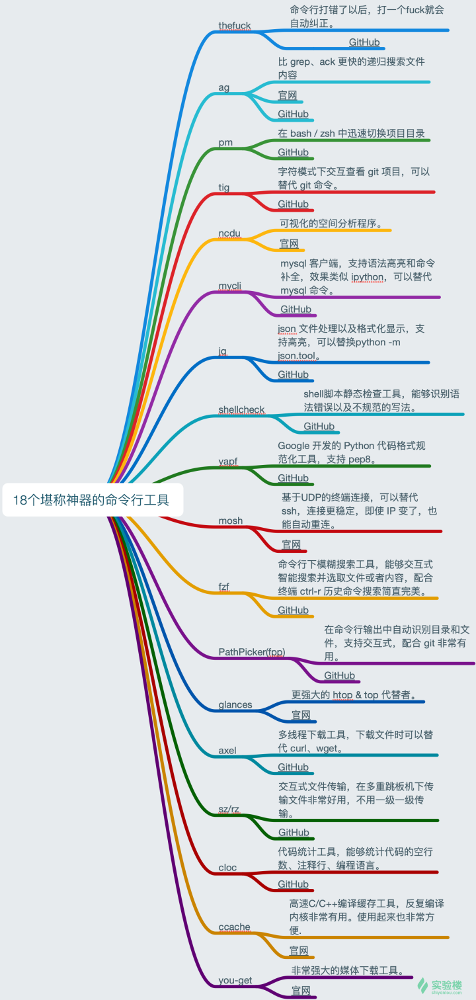

tldr 命令帮助

zsh (以及相应的插件， autojump, )

pandoc文档格式转换

tmux多窗口

fzf[4]是一款用于文本模糊查找的命令行工具。

通过fzf，几乎可以处理系统中的所有内容。

fzf可以帮助你查找计算机中的文件，shell历史记录中，搜索结果或其他任何内容。

icdiff：分屏显示 diff

glances：更强大的 htop / top 代替者

https://zhuanlan.zhihu.com/p/112239120

