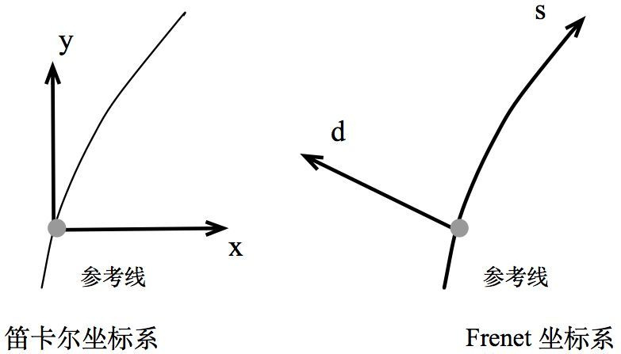

In  lane-level  motion  planning,  optimality  andtime consumption are both important.
Thus, manyautonomous  driving  motion  planning  algorithmsare  developed  in  Frenet  frames  with  time  (SLT)to  reduce  the  planning  dimension  with  the  helpof  a  reference  line.

Finding  the  optimal  trajectoryin  a  Frenet  frame  is  essentially  a  3D  constrainedoptimization problem. There are typically two typesof approaches: direct 3D optimization methods andthe  path-speed  decoupled  method. 

在 Frenet 坐标系中，我们使用道路的中心线作为参考线，使用参考线的切线向量 t 和法线向量 n 建立一个坐标系，如下图的右图所示，这个坐标系即为Frenet 坐标系，它以车辆自身为原点，坐标轴相互垂直，分为 s 方向（即沿着参考线的方向，通常被称为纵向，Longitudinal）和 d 方向（即参考线当前的法向，被称为横向，Lateral），相比于笛卡尔坐标系（下图的作图），Frenet 坐标系明显地简化了问题，因为在公路行驶中，我们总是能够简单的找到道路的参考线（即道路的中心线），那么基于参考线的位置的表示就可以简单的使用纵向距离（即沿着道路方向的距离）和横向距离（即偏离参考线的距离）来描述，同样的，两个方向的速度(s,d)

执行规划算法得到轨迹以后，还要转换到全局坐标系中。