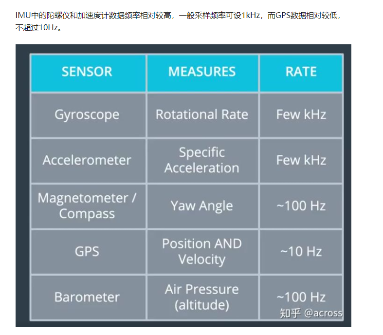
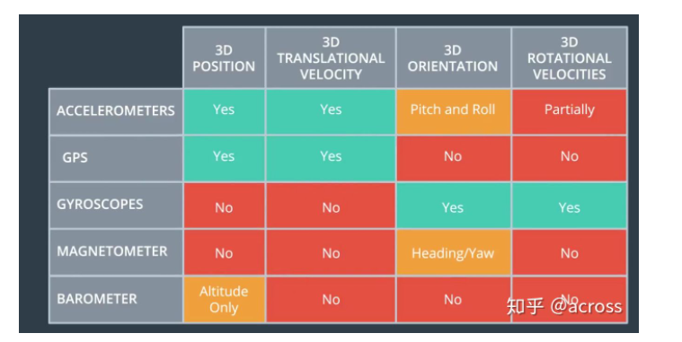

# IMU信号

 IMU主要由陀螺仪（Gyroscope）与加速度计（Accelerometer）组成，其用于测量无人机载体的旋转角速度与线性加速度.
这些加速度和角速度都是基于传感器本身定义的坐标系的。

 磁力计则是用于

磁力计能提供装置在XYZ各轴所承受磁场的数据，接着相关数据会汇入微控制器的运算法，以提供磁北极相关的航向角，利用这些信息可侦测地理方位。
磁力计-获得绝对方向.
磁力计的原理跟指南针原理类似，可以测量出当前设备与东南西北四个方向上的夹角(航向角)。但磁场环境复杂，实际使用中单靠这个也很不靠谱，只能是参考

https://www.guyuehome.com/17458

https://zhuanlan.zhihu.com/p/263593657

## 信号预处理
https://zhuanlan.zhihu.com/p/190842977

单通道移动平均线和中值滤波器应用于每个数据通道，以减少高频信号噪声并消除异常值。

插值算法。线性插值（假设已知点之间是线性的，那么我们根据x就能求出位置点在直线上的位置，也就是y值)，多项式插值。

https://www.zhihu.com/question/22320408/answer/141973314

