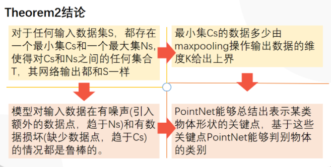

别人都在用花里胡哨的体素化、三维卷积的时候，作者用原始的MLP加个Max-Pooling就解决了点云顺序不变性的问题，并取得了SOTA。而且模型小，运算少。

初看论文的时候大有大巧不工，重剑无锋之感。

时间回到2017年之前，那时候想用深度学习处理点云基本只有体素化一条路。那时候稀疏卷积还没有技术上实现，dense 3D CNN处理一下简单CAD模型还行，放到高分辨率的点云上分分钟就会塞爆显存。PointNet的motivation非常清楚，设计一种网络，可以直接提取点云特征（丢掉体素化），并且保证顺序不变性（从invariance出发设计网络）。具体的实现就是MLP加global max pooling。非常简洁直观。

PointNet++基本是同时期的论文。在PointNet的基础上进了一步，引入了CNN常见的上采样和下采样操作。相当于在不同的scale level上提取特征。

无序
点云数据是一个集合，对数据的顺序是不敏感的。这就意味这处理点云数据的模型需要对数据的不同排列保持不变性。目前文献中使用的方法包括将无序的数据重排序、用数据的所有排列进行数据增强然后使用RNN模型、用对称函数来保证排列不变性。由于第三种方式的简洁性且容易在模型中实现，论文作者选择使用第三种方式，既使用maxpooling这个对称函数来提取点云数据的特征。

点与点之间的空间关系。
一个物体通常由特定空间内的一定数量的点云构成，也就是说这些点云之间存在空间关系。为了能有效利用这种空间关系，论文作者提出了将局部特征和全局特征进行串联的方式来聚合信息。

不变性。
点云数据所代表的目标对某些空间转换应该具有不变性，如旋转和平移。论文作者提出了在进行特征提取之前，先对点云数据进行对齐的方式来保证不变性。对齐操作是通过训练一个小型的网络来得到转换矩阵，并将之和输入点云数据相乘来实现。

点云point cloud的object detection相比较于图片， 有以下三个性质或者难点：

1. 无序性。图片中的像素依次排列，而点云中的点没有特定的顺序。这就要求神经网络对拥有N个点的点云，任意交换其中任意点的输入顺序，网络能够有相同的输出。
2. 点之间的相关性。点不是孤立的，特定范围内点集是有意义的，表示特定范围内的特征，要求网络能够提取这种特征。
3. 旋转不变性。对于表征同一个物体的点云，将其进行刚体变换后，作为网络的输入，网络应该能够得到相同的输出。

PointNet算一个吧。

别人都在用花里胡哨的体素化、三维卷积的时候，作者用原始的MLP加个Max-Pooling就解决了点云顺序不变性的问题，并取得了SOTA。而且模型小，运算少。

# 基本思想

不同顺序的点云数据实际上表示了同一组三维物体，因此，想要从点云中抽取共有特征，文章提出了三个方法：
 
 1. 对于无序点集进行排序。point cnn就是使用了这个方法。
 2. 像RNN一样把点集当做一个序列进行处理。这样做需要进行数据增强，对输入点集做所有的排列变换。
 3. 使用对称函数。

本文就是要了对称函数的方法。文章称对顺序不敏感的函数为对称函数。如加法、点乘，以及本文使用的max pooling等操作

如果没有input transform和feature transform，上述的网络并没有解决旋转不变性。

PointNet认为，要解决旋转不变性，就要对点云做处理。一种思路是将所有点云都提前旋转到一个标准的空间位置（a canonical space）。比如一幅点云表示椅子，则先将椅子旋转到与地面平行再把这个点云喂给网络。有Paper做了这个工作，但是PointNet采用了另外一种思路:

PointNet想法和上面差不多，但是它没有人为地去计算要把椅子旋转到与地面平行的旋转矩阵，而是让T-net去学习这个旋转矩阵！

三个关键结构：
  1、最大池化层，用来将从所有的点上提取得来的信息聚合到一起===》无序性

  2、局部信息和全局信息结合结构===》点间关系

  3、两个对齐网络T-Net，用来将输入点和特征点进行对齐 ====》不变性

  点云》空间对齐》特征变换》特征对齐》特征变换》池化》特征变换==》分类

  点云》空间对齐》特征变换》特征对齐》特征变换》池化》特征拼接》特征变换》特征变换》==》分割

